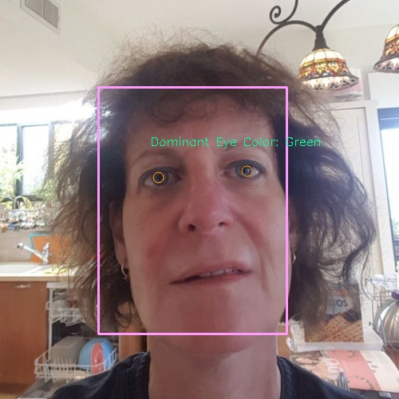
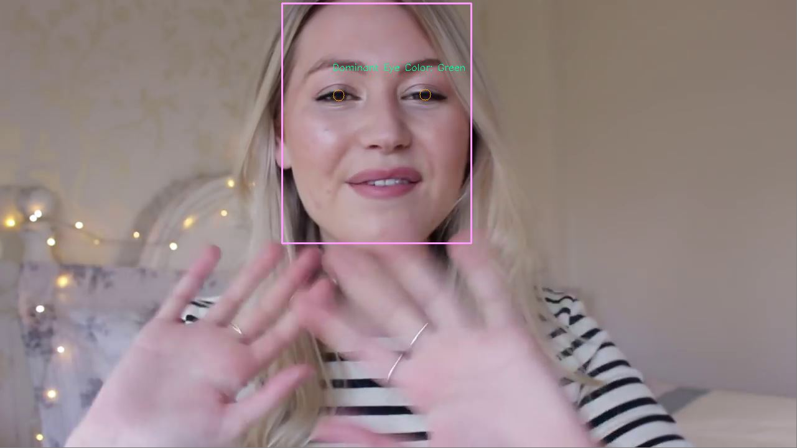

# Eye Color Detection

## Installation 
#### Clone the project and install requirements
    $ git clone https://github.com/ghimiredhikura/Eye-Color-Detection
    $ cd Eye-Color-Detection
    $ sudo pip install -r requirements.txt

    [Note: if you have GPU change tensorflow to tensorflow-gpu in requirements.txt for fast processing]

#### Usage [Image]
    $ python eye-color.py --input_path=sample/2.jpg --input_type=image

**Output:**  

Diminant Eye Color:  Green  

|Color         | Percentage (%)|
|--------------|-----------|
|Blue |  0.0 |
|Blue Gray |  0.0 |
|Brown |  0.0 |
|Brown Gray |  0.0 |
|Brown Black |  0.0 |
|Green |  65.44 |
|Green Gray |  0.0 |
|Other |  34.56 |

#### Usage [Video/Webcam]
    $ python eye-color.py --input_path=sample/video.mp4 --input_type=video

**Output:**  

Dominant Eye Color:  Green

|Color         | Percentage (%)|
|--------------|-----------|
|Blue |  0.0 |
|Blue Gray |  0.0 |
|Brown |  0.0 |
|Brown Gray |  0.0 |
|Brown Black |  0.0 |
|Green |  18.58 |
|Green Gray |  0.79 |
|Other |  80.63 |

